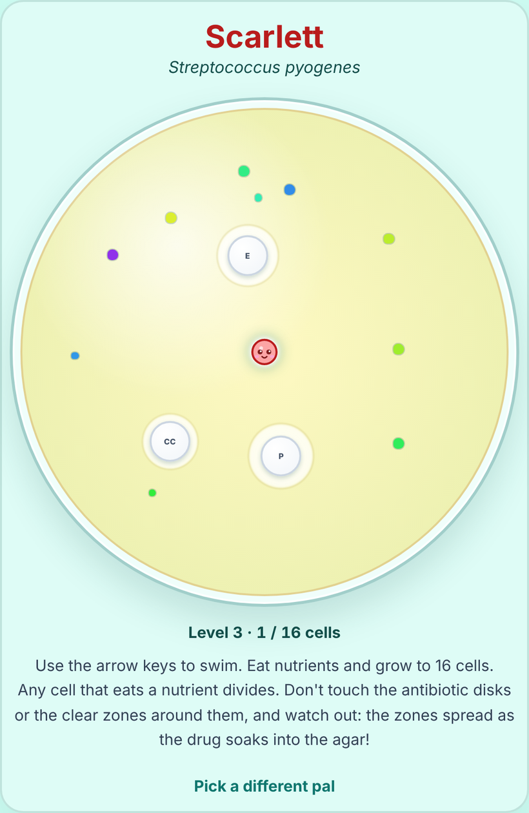
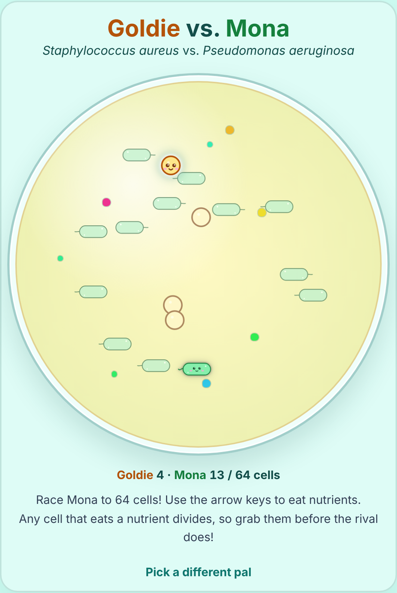

# PetriPals 🧫

A cute microbiology game for the browser. Pick a bacterial pal and eat nutrients to grow your colony. In **classic** mode, steer clear of the antibiotic disks and their zones of inhibition. In **mixed culture** mode, race a rival pal to take over the plate.

**[▶ Play PetriPals](https://jessicasogge.github.io/petripals/)**: works on computers, phones and tablets.

 

## How to play

1. **Pick a pal.** Each one is a real bacterium, drawn as a cartoon.
2. **Choose a mode:** classic or mixed culture.
3. **Swim around the dish.** Use the arrow keys, or on a touch screen, touch and hold where you want to swim.
4. **Eat nutrients to divide.** Every cell that eats a nutrient divides in two, just like binary fission.

### Classic

Grow your colony to the target size to finish the level, but **don't touch the antibiotics.** Touching a disk, or the clear zone of inhibition around it, ends the game. Antibiotics kill bacteria!

There are seven levels. Each one adds another antibiotic disk and doubles the colony you need to grow, from 4 cells up to 256.

### Mixed culture

No antibiotics this time. You share the plate with a rival pal, picked at random and steered by the computer, and the **first colony to reach 64 cells wins.** You get a one-second head start, and the rival swims a little slower than you, but it's quick to spot the nearest nutrient, so grab them before it does!

## The pals

| Pal | Species | Shape |
|---|---|---|
| **Mona** | *Pseudomonas aeruginosa* | Green rod with one flagellum |
| **Vi** | *Vibrio cholerae* | Orange comma-shaped rod |
| **Goldie** | *Staphylococcus aureus* | Golden grape-like clusters of round cells |
| **Scarlett** | *Streptococcus pyogenes* | Red chains of round cells |
| **Elia** | *Borrelia burgdorferi* | Purple corkscrew (spirochete) |
| **Coco** | *Haemophilus influenzae* | Small coffee-with-cream coccobacillus |
| **Penny** | *Streptococcus pneumoniae* | Bluish-purple pair of round cells, with glasses |

## The real science

The game is loosely based on real lab microbiology:

- **How each pal grows:** rods split and swim apart after dividing. Round cells (cocci) stay stuck together, in chains for *Streptococcus*, which divides in one plane, and in grape-like clusters for *Staphylococcus*, which divides in several. *Streptococcus pneumoniae* is a *Streptococcus* too, but it grows in pairs (diplococci), so Penny's chains stop at two cells.
- **Penny's glasses** are a nod to history: pneumococcus is the bacterium that helped show DNA carries genes, in experiments by Frederick Griffith (1928) and by Oswald Avery, Colin MacLeod and Maclyn McCarty (1944).
- **The antibiotic disks** are modeled on the Kirby-Bauer disk test. Each disk is a drug commonly used against that pal's species, labeled with its standard disk code (CIP for ciprofloxacin, P for penicillin, and so on).
- **A mixed culture** is a plate growing more than one species at once, all competing for the same nutrients. That's the idea behind the mixed culture race.
- **The zones of inhibition** are sized from ballpark zone diameters a lab would measure for a susceptible strain of that species, scaled down to fit the dish. A bigger zone means the drug works better. *Borrelia* can't be grown for disk tests, so Elia's zones are made up from how well each drug works on her.

## Running it locally

The game is plain HTML, CSS and JavaScript in [`public/`](public/), with no build step. To run it with the included dev server:

```sh
npm install
npm run dev
```

Then open http://localhost:3000.

## Tests

```sh
npm test
```

The tests use [Vitest](https://vitest.dev/). Most of the game logic runs in [jsdom](https://github.com/jsdom/jsdom), a simulated browser page.

## Project layout

| Path | What's there |
|---|---|
| `public/index.html` | Home page |
| `public/pal-picker.html` | Pick a pal |
| `public/choose-mode.html` | Choose classic or mixed culture |
| `public/petri-dish.html` | The game, in either mode |
| `public/game/` | Game code: classic mode (`game.js`), mixed culture mode (`race.js`, with the rival in `rival.js`), what both share (a colony eating and dividing in `colony.js`, steering in `keyboard.js` and `touch.js`), the pals (`rod.js`, `coccus.js`), antibiotics (`antibiotic.js`), nutrients, physics, and settings (`config.js`) |
| `test/` | Tests |
| `src/index.ts` | Small Express server for local development |

## Deployment

Every push to `main` runs the tests and, if they pass, publishes `public/` to GitHub Pages (see [`.github/workflows/pages.yml`](.github/workflows/pages.yml)).

## Contributing

Bug reports, ideas and fixes are welcome! See [CONTRIBUTING.md](CONTRIBUTING.md) for how to get started, and please follow the [Code of Conduct](CODE_OF_CONDUCT.md).

## License

PetriPals is released under the [MIT License](LICENSE). The confetti uses [canvas-confetti](https://github.com/catdad/canvas-confetti), which is ISC licensed ([`public/game/vendor/confetti.LICENSE`](public/game/vendor/confetti.LICENSE)).

## Credits

Made by Jessica Sogge.
